# Test automation project for service [Bookmate](https://bookmate.com/about)

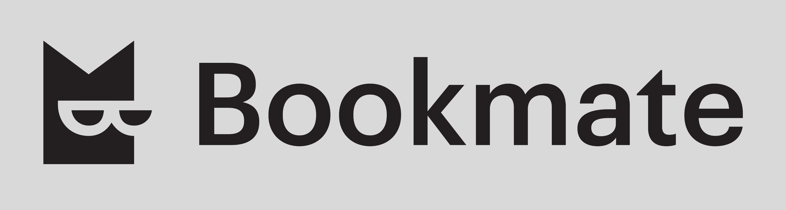

> Bookmate is a subscription based e-book service providing access to books, comics, audiobooks,\
> related social activity - reviews, comments, ratings, private and public bookshelfs.\
> Consists of website and mobile applications for Android and iOS.

# <a name="TableOfContents">Table of contents</a>
+ [Description](#Description)
+ [Tools and technologies](#Technology)
+ [How to run](#Jenkins)
    + [Gradle command](#GradleCommand)
    + [Property files](#PropertyFiles)
      + [Default property files](#PropertyFilesDefaults)
    + [Running tests in Jenkins](#RunInJenkins)
+ [Notifications in Telegram about results](#TelegramNotifications)
+ [Test results report in Allure Report](#AllureReport)
+ [Allure TestOps integration](#AllureTestOps)
    + [Project in Allure TestOps](#AllureTestOpsProject)
    + [Start a run of custom set of tests](#AllureTestOpsStartTests)
    + [Dashboards](#Dashboards)
    + [Defects](#Defects)
+ [Github webhooks](#GithubWebhooks)
+ [Tests](#Tests)
+ [Jira integration](#Jira)
+ [Video of running tests](#Video)


# <a name="Description">Description</a>
The test project consists of WebUI, API and mobile(android) tests.\
A brief list of interesting facts about the project:
- [x] Page Object
- [x] Parametrized build
- [x] Different configuration files for test running depending on build parameters
- [x] Config with Owner library
- [x] Using Lombok for models for API tests
- [x] Serialization/deserialization API requests/responses using Jackson
- [x] Using request/response specifications for API tests
- [x] Custom Allure listener for beautiful API requests/responses logging
- [x] Allure TestOps integration
- [x] Autotests as test documentation
- [x] Github webhooks on each push to trigger Jenkins build
- [x] Jira integration
- [x] Parallel execution


# <a name="Technology">Tools and technologies</a>
<p  align="center">
  <code></code>
  <code></code>
  <code></code>
  <code></code>
  <code></code>
  <code></code>
  <code></code>
  <code></code>
  <code></code>
  <code></code>
  <code></code>
  <code></code>
  <code></code>
  <code></code>
  <code></code>
  <code></code>
</p>

The autotests in this project are written in `Java` using `Selenide` framework.\
`Gradle` - is used as a build automation tool.  \
`JUnit5` - to execute tests.\
`REST Assured` - for easy API testing of REST services.\
`Jenkins` - CI/CD for running tests remotely.\
`Selenoid` - to remote launching browsers in `Docker` containers.\
`Browserstack` - to run mobile tests.\
`Android Studio tools`, `Appium` - to tun mobile tests locally in a mobile device emulator.\
`Allure Report` - for test results visualisation.\
`Telegram Bot` - for test results notifications.\
`Allure TestOps` - as Tests Management System.

[Back to the table of contents ⬆](#TableOfContents)

# <a name="GradleCommand">Gradle command</a>
To run locally and in Jenkins the following command is used:
```bash
gradle clean test -Dtag=<tag> -DrunIn=<runIn>
```
Additional parameters:
> `-Dselenoid_user_sys_prop=enter_user` `-Dselenoid_key_sys_prop=enter_key` - credentials for selenoid\
> `-Dbrowserstack_user_sys_prop=enter_user` `-Dbrowserstack_key_sys_prop=enter_key` - credentials for browserstack\
> `-Dthreads=number_of_threads` can be added for parallel tests execution

`tag` - defines a tag for running specific tests:
>- *API*
>- *WebUI*
>- *Android*
 
`runIn` - defines an environment for running these tests:
>- *\<not defined\>(for API tests)*
>- *browser_selenoid*
>- *browser_local*
>- *android_browserstack*
>- *android_emulator*
>- *android_real*
>- *android_selenoid*

Additional properties are retrieved from the corresponding properties file(depending on `runIn` value):
```bash
./resources/config/project-${runIn}.properties
```

Valid combinations:
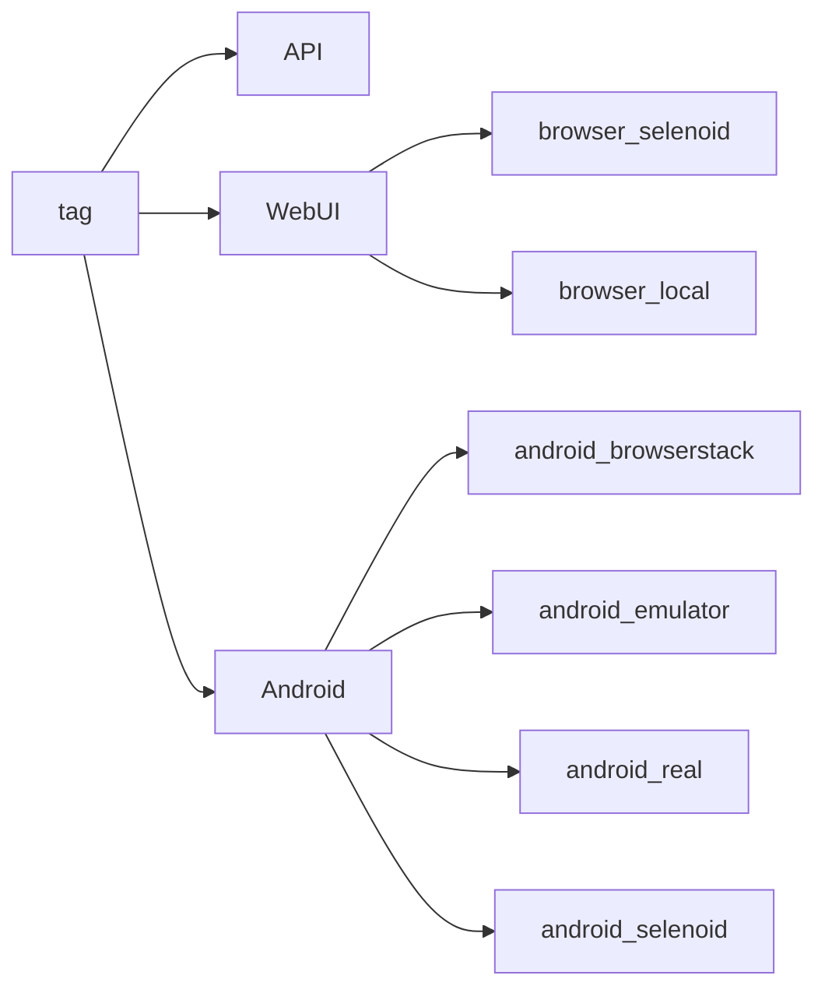

[Back to the table of contents ⬆](#TableOfContents)

# <a name="PropertyFiles">Property files</a>
Structure of `project-${runIn}.properties` file:
```properties
remoteDriver=
browser=
user=
key=
deviceName=
platformVersion=
```

>- *remoteDriver* - URL for remote WebDriver
>- *browser* - browser for running WebUI tests
>- *user* - login for authorization. By default, it's ${browserstack_user_sys_prop} or ${selenide_user_sys_prop}, that is it comes from system properties
>- *key* - key\password for authorization. By default, it's ${browserstack_key_sys_prop} or ${selenide_key_sys_prop}, that is it comes from system properties
>- *deviceName* - android device name or serial number
>- *platformVersion* - android version

[Back to the table of contents ⬆](#TableOfContents)

## <a name="PropertyFilesDefaults">Default property files</a>
> The section below is automatically updated from content of src/test/resources/config/ directory. 

<details>
    <summary><h4>WebUI</h4></summary>

* <details>
    <summary><h4>project-browser_selenoid.properties</h4></summary>

    <!-- MARKDOWN-AUTO-DOCS:START (CODE:src=./src/test/resources/config/project-browser_selenoid.properties) -->
    <!-- The below code snippet is automatically added from ./src/test/resources/config/project-browser_selenoid.properties -->
    ```properties
    remoteDriver=https://selenoid.autotests.cloud/wd/hub
    browser=chrome
    user=${selenoid_user_sys_prop}
    key=${selenoid_key_sys_prop}
    deviceName=
    platformVersion=
    ```
    <!-- MARKDOWN-AUTO-DOCS:END -->
  
  </details>
* <details>
    <summary><h4>project-browser_local.properties</h4></summary>

    <!-- MARKDOWN-AUTO-DOCS:START (CODE:src=./src/test/resources/config/project-browser_local.properties) -->
    <!-- The below code snippet is automatically added from ./src/test/resources/config/project-browser_local.properties -->
    ```properties
    remoteDriver=
    browser=chrome
    user=
    key=
    deviceName=
    platformVersion=
    ```
    <!-- MARKDOWN-AUTO-DOCS:END -->

  </details>

</details>


<details>
    <summary><h4>Android</h4></summary>

* <details>
    <summary><h4>project-android_browserstack.properties</h4></summary>

    <!-- MARKDOWN-AUTO-DOCS:START (CODE:src=./src/test/resources/config/project-android_browserstack.properties) -->
    <!-- The below code snippet is automatically added from ./src/test/resources/config/project-android_browserstack.properties -->
    ```properties
    remoteDriver=
    browser=
    user=${browserstack_user_sys_prop}
    key=${browserstack_key_sys_prop}
    deviceName=Samsung Galaxy S22 Ultra
    platformVersion=12.0
    ```
    <!-- MARKDOWN-AUTO-DOCS:END -->

  </details>
* <details>
    <summary><h4>project-android_emulator.properties</h4></summary>

    <!-- MARKDOWN-AUTO-DOCS:START (CODE:src=./src/test/resources/config/project-android_emulator.properties) -->
    <!-- The below code snippet is automatically added from ./src/test/resources/config/project-android_emulator.properties -->
    ```properties
    remoteDriver=http://localhost:4723/wd/hub
    browser=
    user=
    key=
    deviceName=Pixel_4_API_30
    platformVersion=11.0
    ```
    <!-- MARKDOWN-AUTO-DOCS:END -->

  </details>
* <details>
    <summary><h4>project-android_real.properties</h4></summary>

    <!-- MARKDOWN-AUTO-DOCS:START (CODE:src=./src/test/resources/config/project-android_real.properties) -->
    <!-- The below code snippet is automatically added from ./src/test/resources/config/project-android_real.properties -->
    ```properties
    remoteDriver=http://localhost:4723/wd/hub
    browser=
    user=
    key=
    deviceName=5200aecd4956a489
    platformVersion=8.0
    ```
    <!-- MARKDOWN-AUTO-DOCS:END -->

  </details>
* <details>
    <summary><h4>project-android_selenoid.properties</h4></summary>

    <!-- MARKDOWN-AUTO-DOCS:START (CODE:src=./src/test/resources/config/project-android_selenoid.properties) -->
    <!-- The below code snippet is automatically added from ./src/test/resources/config/project-android_selenoid.properties -->
    ```properties
    remoteDriver=https://selenoid.autotests.cloud/wd/hub
    browser=
    user=${selenoid_user_sys_prop}
    key=${selenoid_key_sys_prop}
    deviceName=android
    platformVersion=8.1
    ```
    <!-- MARKDOWN-AUTO-DOCS:END -->

  </details>

</details>

[Back to the table of contents ⬆](#TableOfContents)

# <a name="RunConfigurationsInIDEA">Run configurations in IDEA</a>
For convenience of running tests, IDEA run configurations are committed to this project
<p  align="center">
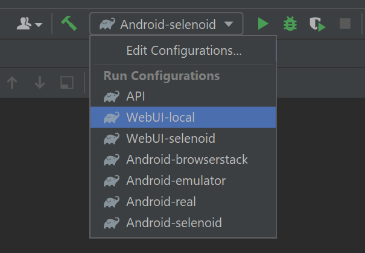
</p>

<p  align="center">
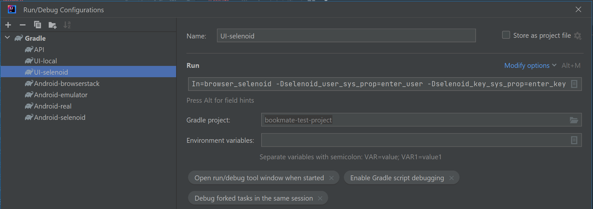
</p>

[Back to the table of contents ⬆](#TableOfContents)

# <a name="RunInJenkins">Running tests in [Jenkins](https://jenkins.autotests.cloud/job/C12-vyach_son-bookmate_test/)</a>
Main page of the build:
<p  align="center">
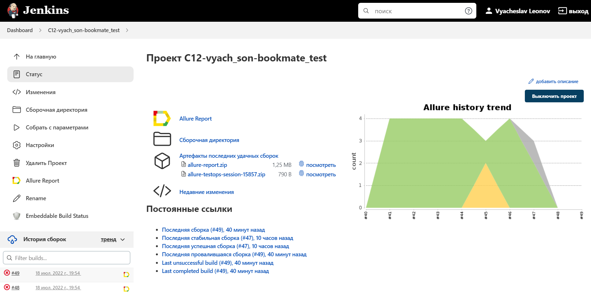
</p>

A parametrized Jenkins job can be launched with needed ***tag*** and ***runIn***:
<p  align="center">

</p>

`project-{runIn}.properties` config files are created in the build workspace on start build.\
As soon as the build is done the workspace is deleted.

Sensitive information(login names and passwords) is stored in an encrypted form in Jenkins credential storage.\
And relatively safe transferred to the build by gradle arguments(see [Gradle command](#GradleCommand) section, 'Additional parameters') and it's values masked in the logs.

After the build is done the test results are available in:
>- <code><strong>*Allure Report*</strong></code>
>- <code><strong>*Allure TestOps*</strong></code> - results are uploaded there and the automated test-cases can be automatically updated accordingly to the recent changes in the code.

<p  align="center">
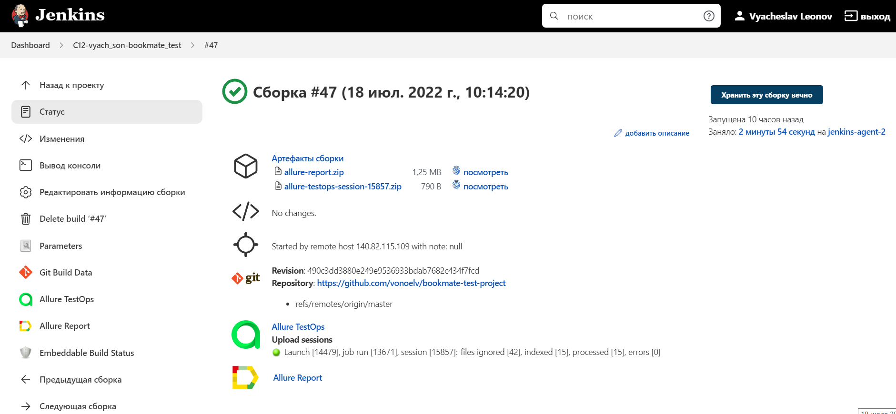
</p>

[Back to the table of contents ⬆](#TableOfContents)


# <a name="TelegramNotifications">Notifications in Telegram about results</a>
Telegram bot sends a brief report to a specified telegram chat by results of each build.
<p  align="center">
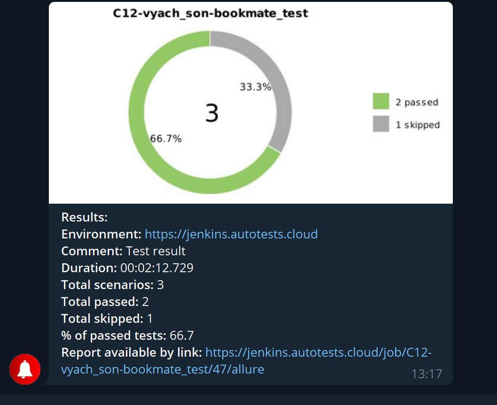
</p>

[Back to the table of contents ⬆](#TableOfContents)

# <a name="AllureReport">Test results report in [Allure Report](https://jenkins.autotests.cloud/job/C12-vyach_son-bookmate_test/47/allure/)</a>

## Main page
Main page of Allure report contains the following blocks:

>- <code><strong>*ALLURE REPORT*</strong></code> - displays date and time of the test, overall number of launched tests, а также диаграмму с указанием процента и количества успешных, упавших и сломавшихся в процессе выполнения тестов
>- <code><strong>*TREND*</strong></code> - displays trend of running tests for all runs
>- <code><strong>*SUITES*</strong></code> - displays distribution of tests by suites
>- <code><strong>*CATEGORIES*</strong></code> - displays distribution of unsuccessful tests by defect types
<p align="center">
  
</p>

## List of tests with steps and test artefacts
On the page the list of the tests grouped by suites with status shown for each test.\
Full info about each test can be shown: tags, severity, duration, detailed steps.

<p align="center">
  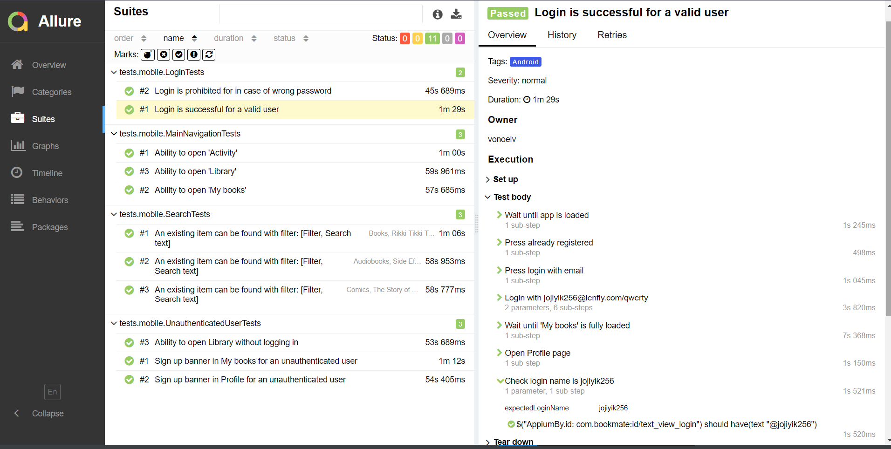
</p>

Also additional test artifacts are available:
>- Screenshot
>- Page Source
>- Video
>- Browserstack full info link

<p align="left">
  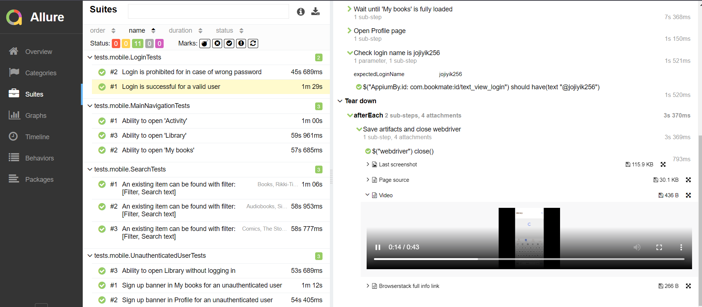
</p>

[Back to the table of contents ⬆](#TableOfContents)

# <a name="AllureTestOps">[Allure TestOps](https://allure.autotests.cloud/project/1466/test-cases?treeId=2804) integration</a>
> The link can be accessed only by authorized users.

## <a name="AllureTestOpsProject">Project in Allure TestOps</a>
Test-cases in the project are imported and constantly updated from the code,
so there is no need in complex process of synchronization manual test-cases and autotests.\
It is enough to create and update an autotest in the code and the test-case in TMS always will be in actual state.\
Manual test-cases also can be added in TMS in case of need(via web interface or via code).
<p align="center">
  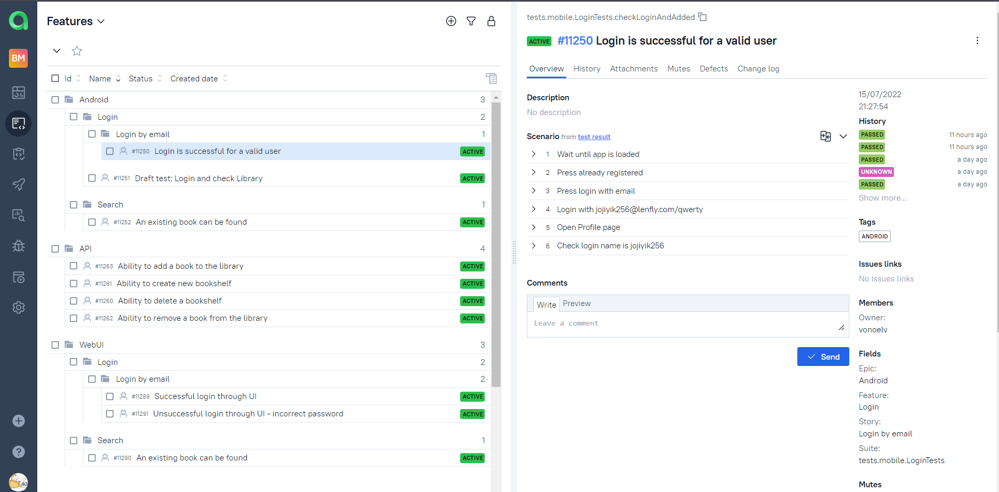
</p>

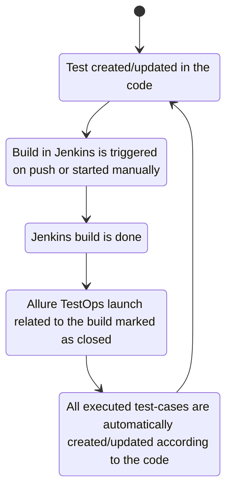

## <a name="AllureTestOpsStartTests">Ability to start a run of custom set of tests from Allure TestOps</a>
Any person not related to autotest creation can select a set of tests, environment parameter(RunIn) and start a run.\
Allure TestOps run will be created, Jenkins job triggered with correct parameters. And results of the job will be seamlessly integrated into Allure TestOps.
<p align="center">
  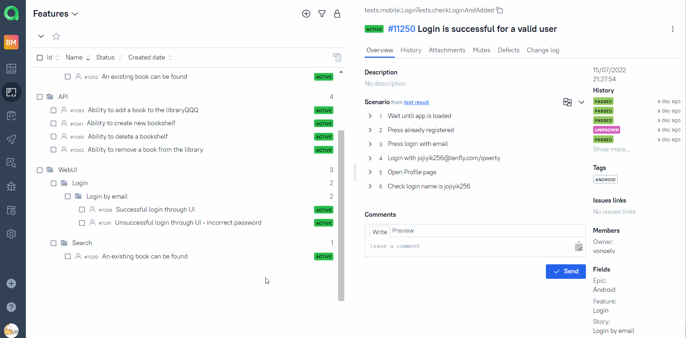
</p>

As soon as the Jenkins job is done, corresponding tests get their statuses. A tester can finish manual tests(if any) and click "Close launch".

<p align="center">
  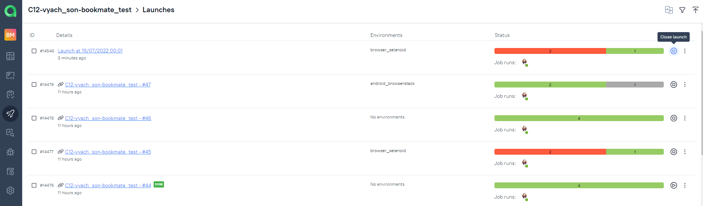
</p>

> After that all these test-cases(names, steps, tags etc) will be updated according to the recent code changes.

[Back to the table of contents ⬆](#TableOfContents)

## <a name="Dashboards">Dashboards</a>
Automation trends charts, distribution tests by some different parameters etc:
<p align="center">
  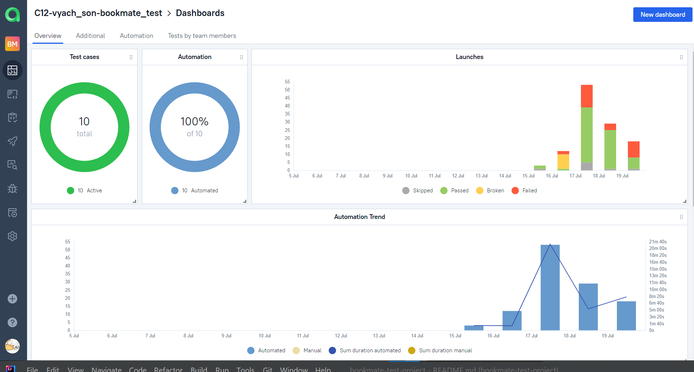
</p>

<p align="center">
  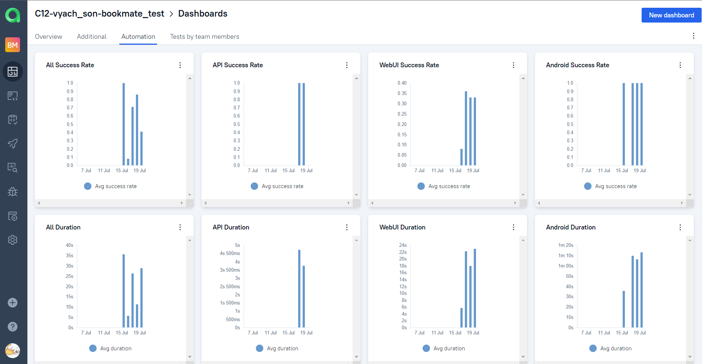
</p>

<p align="center">
  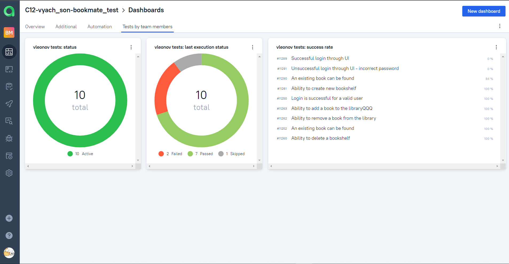
</p>

<p align="center">
  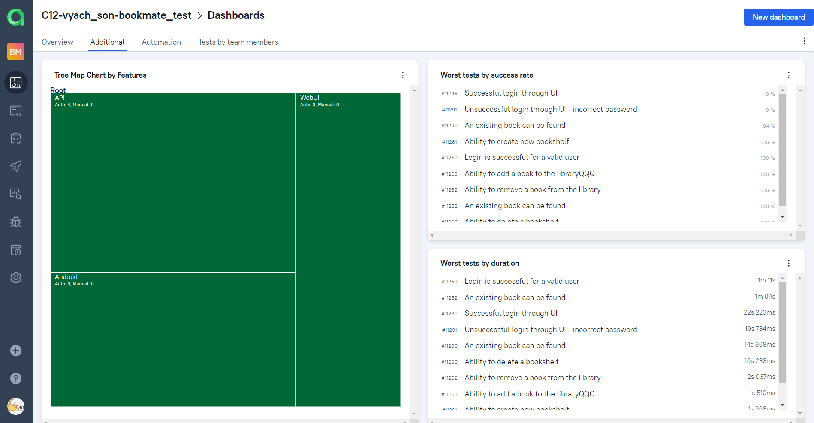
</p>

[Back to the table of contents ⬆](#TableOfContents)

## <a name="Defects">Defects</a>
Knows defects are automatically recognized by defined patterns for test fails in further launches.
<p align="center">
  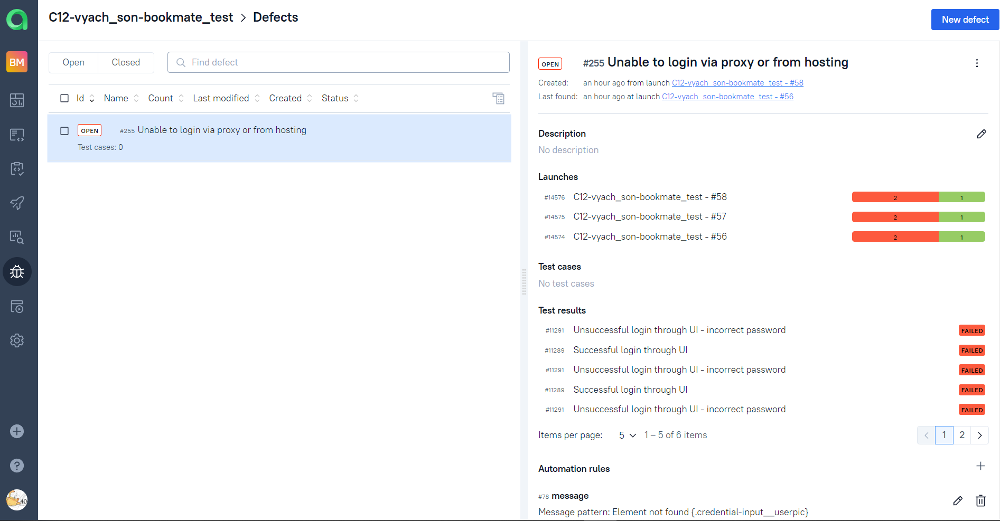
</p>

[Back to the table of contents ⬆](#TableOfContents)


# <a name="GithubWebhooks">Github webhooks</a>
Each push to the repository triggers 3 builds in Jenkins:
```bash
gradle clean test -Dtag=API
```
```bash
gradle clean test -Dtag=WebUI -DrunIn=browser_selenoid
```
```bash
gradle clean test -Dtag=Android -DrunIn=android_browserstack
```
This way we can find problems earlier and always have actual state of test-cases in Allure TestOps.
<p align="center">
  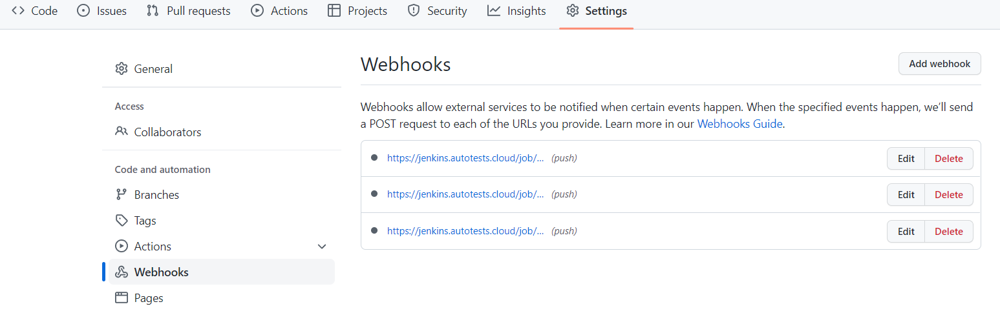
</p>

<p align="center">
  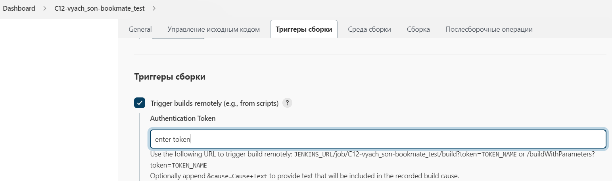
</p>


[Back to the table of contents ⬆](#TableOfContents)


# <a name="JiraIntegration">Jira integration</a>
<p align="center">
  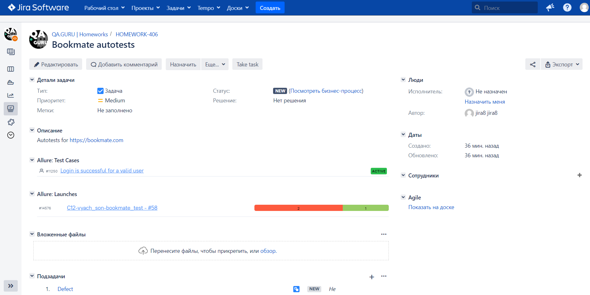
</p>

[Back to the table of contents ⬆](#TableOfContents)


# <a name="Tests">Tests</a>
## Checks

[Back to the table of contents ⬆](#TableOfContents)


# <a name="Video">Video of running tests</a>


https://user-images.githubusercontent.com/103368614/179863691-82742593-e256-4bed-9fdc-f045bbed27e6.mp4


https://user-images.githubusercontent.com/103368614/179863761-a42a6c4f-b7ff-48eb-b35e-e454baabb0f4.mp4


[Back to the table of contents ⬆](#TableOfContents)
