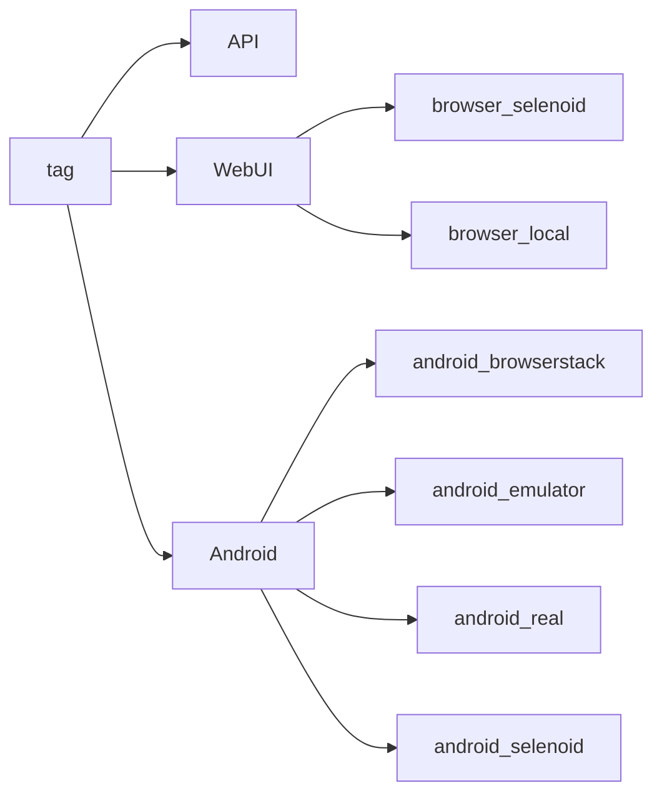
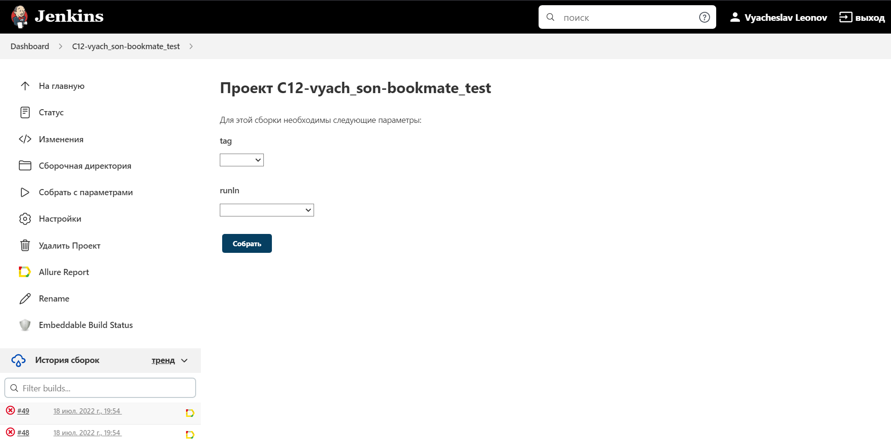
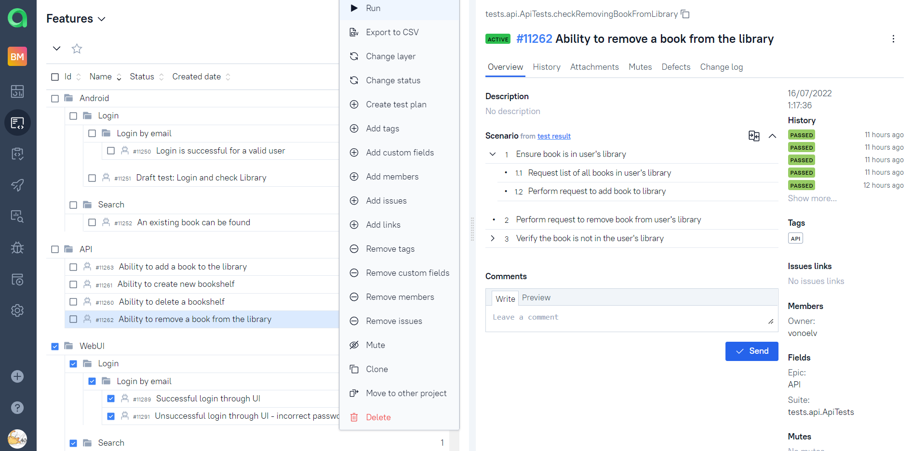
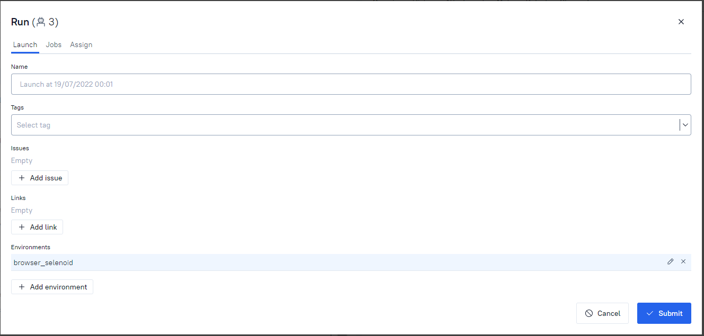
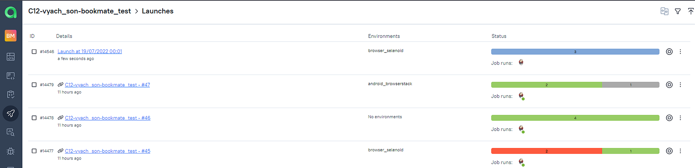

# Test automation project for service [Bookmate](https://bookmate.com/about)


> Bookmate is a subscription based e-book service providing access to books, comics, audiobooks,\
> related social activity - reviews, comments, ratings, private and public bookshelfs.\
> Consists of website and mobile applications for Android and iOS.

## <a name="TableOfContents">Table of contents</a>
+ [Description](#Description)
+ [Tools and technologies](#Technology)
+ [How to run](#Jenkins)
    + [Gradle command](#GradleCommand)
    + [Property files](#PropertyFiles)
      + [Examples of property files](#PropertiesExamples)
    + [Running tests in Jenkins](#RunInJenkins)
    + [Notifications in Telegram about results](#TelegramNotifications)
+ [Test results report in Allure Report](#AllureReport)
+ [Allure TestOps integration](#AllureTestOps)
+ [Results](#Results)
<!-- + [Jira integration](#Jira) -->


## <a name="Description">Description</a>
The test project consists of WebUI, API and mobile(android) tests.


# <a name="Technology">Tools and technologies</a>
<p  align="center">
  <code></code>
  <code></code>
  <code></code>
  <code></code>
  <code></code>
  <code></code>
  <code></code>
  <code></code>
  <code></code>
  <code></code>
  <code></code>
  <code></code>
  <code></code>
  <code></code>
  <code></code>
  <code></code>
</p>

The autotests in this project are written in **Java** using **Selenide** framework.\
**Gradle** - is used as a build automation tool.  \
**JUnit5** - to execute tests.\
**Jenkins** - CI/CD for running tests remotely.\
**Selenoid** - to remote launching browsers in **Docker** containers.\
**Browserstack** - to run mobile tests.\
**Android Studio tools**, **Appium** - to tun mobile tests locally in a mobile device emulator.\
**Allure Report** - for test results visualisation.\
**Telegram Bot** - for test results notifications.\
**Allure TestOps** - as Tests Management System.

[Back to the table of contents ⬆](#TableOfContents)

# <a name="GradleCommand">Gradle command</a>
To run locally and in Jenkins the following command is used:
```bash
gradle clean test -Dtag=<tag> -DrunIn=<runIn>
```

> Also "-Dthreads=<number_of_threads>" can be added for parallel tests execution.

**tag** - defines a tag for running specific tests:
- API
- WebUI
- Android
 
**runIn** - defines an environment for running these tests:
- \<not defined\>(for API tests)
- browser_selenoid
- browser_local
- android_browserstack
- android_emulator
- android_real
- android_selenoid

Additional properties are retrieved from the corresponding properties file:
```
./resources/config/project-${runIn}.properties
```

Valid combinations:


[Back to the table of contents ⬆](#TableOfContents)

# <a name="PropertyFiles">Property files</a>
Structure of ***project-${runIn}.properties*** file:
```
remoteDriver=
browser=
user=
key=
deviceName=
platformVersion=
```

>- *remoteDriver* - URL for remote WebDriver
>- *browser* - browser for running WebUI tests
>- *user* - login for authorization
>- *key* - key\password for authorization
>- *deviceName* - android device name or serial number
>- *platformVersion* - android version

[Back to the table of contents ⬆](#TableOfContents)

### <a name="PropertiesExamples">Examples of property files</a>

<details>
    <summary><h4>project-browser_selenoid.properties</h4></summary>

        remoteDriver=https://selenoid.autotests.cloud/wd/hub
        browser=chrome
        user=enter_user
        key=enter_key
        deviceName=
        platformVersion=

</details>

<details>
    <summary><h4>project-browser_local.properties</h4></summary>

        remoteDriver=
        browser=chrome
        user=
        key=
        deviceName=
        platformVersion=

</details>

<details>
    <summary><h4>project-android_browserstack.properties</h4></summary>

        remoteDriver=
        browser=
        user=enter_user
        key=enter_key
        deviceName=
        platformVersion=

</details>

<details>
    <summary><h4>project-android_emulator.properties</h4></summary>

        remoteDriver=http://localhost:4723/wd/hub
        browser=
        user=
        key=
        deviceName=Pixel_4_API_30
        platformVersion=11.0

</details>

<details>
    <summary><h4>project-android_real.properties</h4></summary>

        remoteDriver=http://localhost:4723/wd/hub
        browser=
        user=
        key=
        deviceName=5200aecd4956a489
        platformVersion=8.0

</details>

<details>
    <summary><h4>project-android_selenoid.properties</h4></summary>

        remoteDriver=https://selenoid.autotests.cloud/wd/hub
        browser=
        user=enter_user
        key=enter_key
        deviceName=
        platformVersion=

</details>

[Back to the table of contents ⬆](#TableOfContents)

# <a name="RunConfigurationsInIDEA">Run configurations in IDEA</a>
For convenience of running tests, IDEA run configurations are committed to this project
<p  align="center">

</p>

<p  align="center">

</p>

[Back to the table of contents ⬆](#TableOfContents)

# <a name="RunInJenkins">Running tests in [Jenkins](https://jenkins.autotests.cloud/job/12_vyach_son/xxxx)</a>
Main page of the build:
<p  align="center">

</p>

A parametrized Jenkins job can be launched with needed ***tag*** and ***runIn***:
<p  align="center">

</p>

project-{runIn}.properties files with potentially sensitive information are created in the build workspace on start build.\
As soon as the build is done the workspace is deleted.

After the build is done the results are available in:
- Allure Report
- Allure TestOps - results are uploaded there and the automated test-cases can be automatically updated accordingly to the recent changes in the code.
<p  align="center">

</p>

[Back to the table of contents ⬆](#TableOfContents)


# <a name="TelegramNotifications">Notifications in Telegram about results</a>
Telegram bot sends a brief report to a specified telegram chat by results of each build.
<p  align="center">

</p>

[Back to the table of contents ⬆](#TableOfContents)

# <a name="AllureReport">Allure Report[](https://jenkins.autotests.cloud/job/12_vyach_son/xxxx)</a>

## Main page
Main page of Allure report contains the following blocks:

>- <code><strong>*ALLURE REPORT*</strong></code> - displays date and time of the test, overall number of launched tests, а также диаграмму с указанием процента и количества успешных, упавших и сломавшихся в процессе выполнения тестов
>- <code><strong>*TREND*</strong></code> - displays trend of running tests for all runs
>- <code><strong>*SUITES*</strong></code> - displays distribution of tests by suites
>- <code><strong>*CATEGORIES*</strong></code> - displays distribution of unsuccessful tests by defect types
<p align="center">
  
</p>

## List of tests with steps and test artefacts
On the page the list of the tests grouped by suites with status shown for each test.\
Full info about each test can be shown: tags, severity, duration, detailed steps.

<p align="center">
  
</p>

Also available additional test artifacts as:
- Screenshot
- Page Source
- Video
- Browserstack full info link

<p align="center">
  
</p>

[Back to the table of contents ⬆](#TableOfContents)

# <a name="AllureTestOps">Allure TestOps[](https://jenkins.autotests.cloud/job/12_vyach_son/xxxx)</a>

## Project in Allure TestOps
All test-cases in the project are imported and constantly updated from the code,\
so there is no need in complex process of synchronization manual test-cases and autotests.\
It is enough to create and update an autotest in the code and the test-case in TMS always will be in actual state.\
Although, manual test-cases can be added in TMS in case of need(via web interface or via code).
<p align="center">
  
</p>
///ADD SCHEME of test cases creation/updating

## Ability to start a run of custom set of tests from Allure TestOps
Any person not related to autotest creation can select a set of tests, environment parameter(RunIn) and start a run.\
Allure TestOps run will be created, Jenkins job triggered with correct parameters. And results of the job will be seamlessly integrated into Allure TestOps.
<p align="center">
  
</p>
<p align="center">
  
</p>
<p align="center">
  
</p>

As soon as the Jenkins job is done, corresponding tests get their statuses. A tester can finish manual tests(if any) and click "Close launch".

<p align="center">
  
</p>

> After that all these test-cases(names, steps, tags etc) will be updated according to the recent code changes.

## Dashboards
Automation trends charts, distribution tests by some different parameters etc:
<p align="center">
  
</p>

## Defects

[Back to the table of contents ⬆](#TableOfContents)

# Github webhooks

[Back to the table of contents ⬆](#TableOfContents)

# Jira integration
## Jira tickets for defects

[Back to the table of contents ⬆](#TableOfContents)
